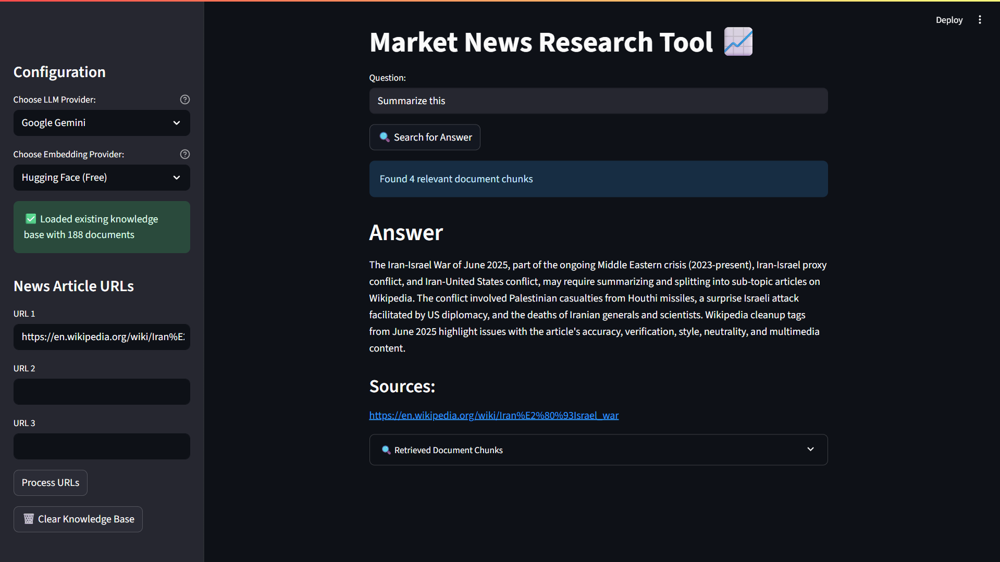

# News Research Tool 📈

This is a powerful, user-friendly news research tool designed for effortless information retrieval and analysis. Users can input article URLs and ask questions to receive relevant insights from news articles and web content.



## ✨ Features

### 🔧 **Multiple LLM Providers**
- **OpenAI GPT** - Fast and reliable responses
- **Anthropic Claude** - Advanced reasoning capabilities  
- **Google Gemini** - Powerful multimodal understanding
- **Ollama (Local)** - Run models locally for privacy
- **Local HuggingFace** - Offline model support

### 🧠 **Flexible Embedding Options**
- **HuggingFace Embeddings** - Free, high-quality embeddings
- **OpenAI Embeddings** - Premium embeddings with fallback support
- Automatic fallback between providers

### 📊 **Advanced Vector Storage**
- **ChromaDB** - Modern, efficient vector database
- Persistent storage across sessions
- Automatic knowledge base management
- Document chunking and indexing

### 🔍 **Smart Content Processing**
- **WebBaseLoader** - Robust web content extraction
- **RecursiveCharacterTextSplitter** - Intelligent text chunking
- Support for multiple URL processing
- Automatic content validation

### 🎯 **Enhanced User Experience**
- **Real-time processing feedback** with loading spinners
- **Knowledge base persistence** - no need to reprocess URLs
- **Clear error messages** and helpful guidance
- **Debug information** for troubleshooting
- **Source attribution** for answers

### 🛠️ **Developer Friendly**
- **Environment-based configuration** (.env support)
- **Comprehensive error handling**
- **Deployment-ready** with compatibility checks
- **Modular architecture** for easy customization

## 🚀 Installation

### 1. Clone the Repository
```bash
git clone https://github.com/adiiityasiingh/Research-Tool-Langchain.git
cd Research-Tool-Langchain
```

### 2. Install Dependencies
```bash
pip install -r requirements.txt
```

### 3. Environment Setup
Create a `.env` file in the project root with your API keys:

```bash
# Required for OpenAI
OPENAI_API_KEY=your_openai_api_key_here

# Optional - for Anthropic Claude
ANTHROPIC_API_KEY=your_anthropic_api_key_here

# Optional - for Google Gemini  
GOOGLE_API_KEY=your_google_api_key_here
```

## 🎮 Usage

### 1. Start the Application
```bash
streamlit run main.py
```

### 2. Configure Your Setup
- **Select LLM Provider**: Choose from OpenAI, Claude, Gemini, Ollama, or Local HuggingFace
- **Choose Embeddings**: Pick between HuggingFace (free) or OpenAI embeddings
- **Add URLs**: Input up to 3 news article URLs in the sidebar

### 3. Process Content
- Click **"Process URLs"** to load and index the articles
- Watch real-time progress indicators
- Verify document count in the success message

### 4. Ask Questions
- Type your question in the main interface
- Click **"🔍 Search for Answer"**
- View the answer with source attribution
- Expand **"Retrieved Document Chunks"** for debugging

### 5. Manage Knowledge Base
- **Clear Knowledge Base**: Use the trash button to reset
- **Add More URLs**: Process additional articles to expand knowledge
- **Persistent Storage**: Your knowledge base persists between sessions

## 🔧 Configuration Options

### LLM Providers
| Provider | Requirements | Best For |
|----------|-------------|----------|
| OpenAI | API Key | General use, fast responses |
| Claude | API Key | Complex reasoning, analysis |
| Gemini | API Key | Multimodal content |
| Ollama | Local install | Privacy, offline use |
| HuggingFace | Local models | Custom models, offline |

### Embedding Providers
| Provider | Cost | Quality | Speed |
|----------|------|---------|-------|
| HuggingFace | Free | High | Fast |
| OpenAI | Paid | Very High | Very Fast |

## 🚀 Deployment

### Streamlit Cloud
1. Push your code to GitHub
2. Connect your repository to Streamlit Cloud
3. Set environment variables in the Streamlit Cloud dashboard
4. Deploy!

### Platform Considerations
- **SQLite Version**: Requires SQLite ≥ 3.35.0 for ChromaDB
- **Memory**: Local models require additional RAM
- **API Limits**: Monitor usage for paid providers

### Recommended Platforms
- ✅ **Railway** - Modern SQLite, easy deployment
- ✅ **Render** - Good compatibility, free tier
- ✅ **Heroku** - Reliable, paid service
- ⚠️ **Streamlit Cloud** - May have SQLite limitations

## 📁 Project Structure

```
Research-Tool-Langchain/
├── main.py                 # Main Streamlit application
├── requirements.txt        # Python dependencies
├── README.md              # This file
├── .env                   # Environment variables (create this)
├── .gitignore            # Git ignore rules
├── chroma_db/            # ChromaDB storage (auto-created)
│   └── ...               # Vector database files
└── rockybot.jpg          # App logo
```

## 🛠️ Troubleshooting

### Common Issues

**"SQLite version too old"**
- Deploy to a platform with SQLite ≥ 3.35.0
- Consider Railway, Render, or Heroku

**"No working embeddings provider found"**
- Check your API keys in `.env`
- Try switching between embedding providers

**"I don't know" responses**
- Check the "Retrieved Document Chunks" section
- Verify URLs are accessible and contain text
- Try rephrasing your question

**Local model issues**
- Install required packages: `pip install torch transformers sentence-transformers`
- Ensure sufficient disk space for model downloads

### Error Messages
- **Red error messages**: Critical issues requiring immediate attention
- **Yellow warnings**: Issues that may affect functionality
- **Blue info messages**: Helpful guidance and status updates

## 🔄 Recent Updates

- ✅ **Multiple LLM Support** - Added Claude, Gemini, Ollama, and local models
- ✅ **ChromaDB Integration** - Replaced FAISS with modern vector database
- ✅ **Enhanced Error Handling** - Better user feedback and debugging
- ✅ **Persistent Storage** - Knowledge base persists between sessions
- ✅ **Deployment Optimizations** - Better compatibility and fallbacks
- ✅ **Improved UX** - Loading spinners, progress indicators, and clear messaging

## 🤝 Contributing

1. Fork the repository
2. Create a feature branch
3. Make your changes
4. Test thoroughly
5. Submit a pull request

## 📄 License

This project is licensed under the MIT License - see the LICENSE file for details.

## 🙏 Acknowledgments

- **LangChain** for the powerful framework
- **Streamlit** for the web interface
- **ChromaDB** for vector storage
- **HuggingFace** for open-source models and embeddings
